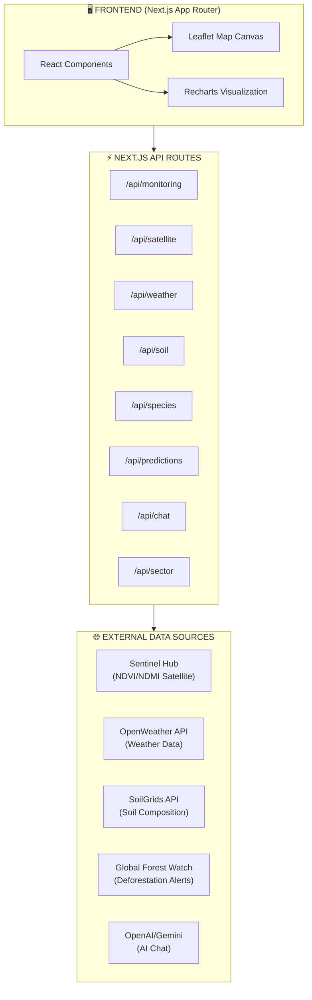
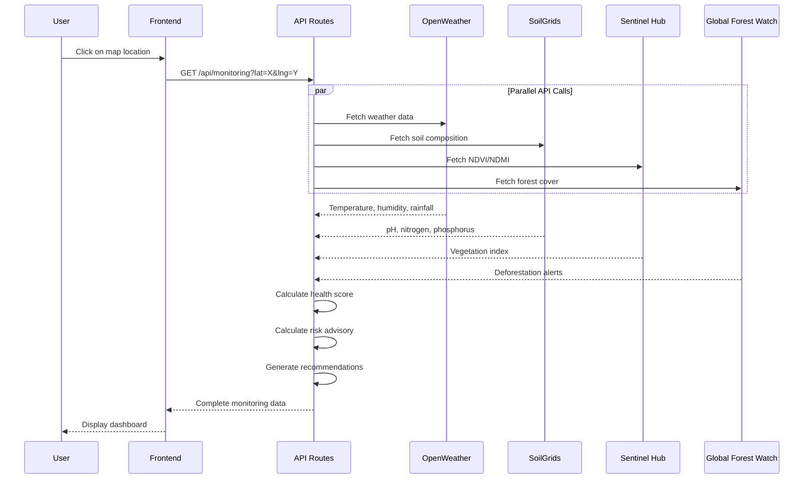

# 🌲 Habitat - Adaptive Reforestation Platform

<div align="center">


**A GIS-powered intelligent reforestation planning and monitoring platform**

*Built for TSec Hacks Hackathon*

[Features](#-features) • [Architecture](#-system-architecture) • [User Flow](#-user-journey-flow) • [API Reference](#-api-endpoints) • [Setup](#-quick-start)

</div>

---

## 📋 Table of Contents

1. [Overview](#-overview)
2. [Features](#-features)
3. [System Architecture](#-system-architecture)
4. [User Journey Flow](#-user-journey-flow)
5. [Data Flow](#-data-flow)
6. [Phase Breakdown](#-phase-breakdown)
7. [API Endpoints](#-api-endpoints)
8. [Tech Stack](#-tech-stack)
9. [Quick Start](#-quick-start)
10. [API Keys Setup](#-api-keys-setup)

---

## 🎯 Overview

**Habitat** is an intelligent, GIS-powered adaptive reforestation platform that helps environmental planners, researchers, and organizations make data-driven decisions for ecosystem restoration in India.

The platform combines real-time satellite imagery, weather data, soil analysis, and AI-powered recommendations to provide comprehensive reforestation planning, monitoring, and prediction capabilities.

```
┌─────────────────────────────────────────────────────────────────────────────┐
│                              HABITAT PLATFORM                                │
├─────────────────────────────────────────────────────────────────────────────┤
│                                                                              │
│    📍 SELECT LOCATION    →    📊 ANALYZE DATA    →    🌱 PLAN & MONITOR     │
│                                                                              │
│    User clicks on map         Fetch satellite,        View recommendations, │
│    or enters coordinates      weather, soil data      track ecosystem health│
│                                                                              │
└─────────────────────────────────────────────────────────────────────────────┘
```

---

## ✨ Features

### 🗺️ **Planning Phase**
- Interactive map with India-centric view
- Click-to-analyze any location
- Forest zone overlays (Western Ghats, Eastern Ghats, Central Highlands)
- Afforestation site marking
- Sector-wise analysis with recommendations

### 📊 **Monitoring Phase**
- Real-time ecosystem health score (weighted formula)
- 6 key environmental metrics with impact warnings
- Historical trends visualization (12-month data)
- **Risk Advisory** with drought/flood predictions
- Species recommendations based on conditions
- Actionable irrigation and soil solutions

### 🔬 **Simulation Phase**
- Calamity impact modeling (drought, flood, heat wave, frost, pest outbreak)
- Species survival rate predictions
- Recovery time estimations
- Mitigation recommendations

### 🔮 **Prediction Phase**
- AI-powered ecosystem forecasts
- NDVI trend predictions
- Risk factor analysis
- Optimal action recommendations

### 🤖 **AI Assistant**
- Natural language chat interface
- Context-aware recommendations
- Tool-calling capabilities for real-time data

---

## 🏗️ System Architecture



### Component Architecture

```
┌─────────────────────────────────────────────────────────────────────────────┐
│                            app/page.tsx (Main Dashboard)                      │
├─────────────────────────────────────────────────────────────────────────────┤
│                                                                              │
│  ┌─────────────────────────────────────────────────────────────────────┐   │
│  │                        Phase Navigation                              │   │
│  │   [Planning] [Monitoring] [Simulation] [Prediction]                  │   │
│  └─────────────────────────────────────────────────────────────────────┘   │
│                                                                              │
│  ┌─────────────────────────┐  ┌─────────────────────────────────────────┐  │
│  │      Map Canvas         │  │            Side Panel                    │  │
│  │  (Leaflet + GeoJSON)    │  │  ┌─────────────────────────────────┐   │  │
│  │                         │  │  │  HealthGauge                     │   │  │
│  │  • India-centric view   │  │  │  (Ecosystem Score 0-100)         │   │  │
│  │  • Forest zone overlays │  │  └─────────────────────────────────┘   │  │
│  │  • Click-to-analyze     │  │  ┌─────────────────────────────────┐   │  │
│  │  • Afforestation sites  │  │  │  MetricCards (6 metrics)        │   │  │
│  │                         │  │  │  • NDVI • Moisture • Temp        │   │  │
│  └─────────────────────────┘  │  │  • AQI • Forest Cover • pH       │   │  │
│                                │  └─────────────────────────────────┘   │  │
│                                │  ┌─────────────────────────────────┐   │  │
│                                │  │  TrendsChart (12-month history) │   │  │
│                                │  └─────────────────────────────────┘   │  │
│                                │  ┌─────────────────────────────────┐   │  │
│                                │  │  RiskAdvisory                   │   │  │
│                                │  │  • Drought/Flood/Heat alerts    │   │  │
│                                │  │  • Species recommendations      │   │  │
│                                │  │  • Irrigation solutions         │   │  │
│                                │  └─────────────────────────────────┘   │  │
│                                └─────────────────────────────────────────┘  │
│                                                                              │
│  ┌─────────────────────────────────────────────────────────────────────┐   │
│  │                        AI Chat (Collapsible)                         │   │
│  └─────────────────────────────────────────────────────────────────────┘   │
│                                                                              │
└─────────────────────────────────────────────────────────────────────────────┘
```

---

## 🚀 User Journey Flow

```mermaid
flowchart LR
    subgraph Start["🏠 START"]
        A[User Opens App]
    end
    
    subgraph Planning["📍 PLANNING PHASE"]
        B[View India Map]
        C[Click Location / Enter Coords]
        D[Analyze Sector]
        E[View Species Recommendations]
        F[Mark Afforestation Sites]
    end
    
    subgraph Monitoring["📊 MONITORING PHASE"]
        G[View Health Score]
        H[Check 6 Metrics]
        I[View Impact Warnings]
        J[12-Month Trends]
        K[Risk Advisory]
    end
    
    subgraph Simulation["🔬 SIMULATION PHASE"]
        L[Select Calamity Type]
        M[Set Severity & Duration]
        N[Run Simulation]
        O[View Species Impact]
        P[Get Recommendations]
    end
    
    subgraph Prediction["🔮 PREDICTION PHASE"]
        Q[View AI Forecasts]
        R[Check Risk Factors]
        S[Plan Actions]
    end
    
    A --> B
    B --> C
    C --> D
    D --> E
    E --> F
    F --> G
    G --> H
    H --> I
    I --> J
    J --> K
    K --> L
    L --> M
    M --> N
    N --> O
    O --> P
    P --> Q
    Q --> R
    R --> S
```



### Detailed User Flow

```
┌─────────────────────────────────────────────────────────────────────────────┐
│                            USER JOURNEY                                      │
└─────────────────────────────────────────────────────────────────────────────┘

STEP 1: LANDING
═══════════════
    User opens app
         │
         ▼
    ┌─────────────────────────────────────┐
    │  India-centric map loads            │
    │  Forest zone overlays displayed     │
    │  Default: Planning phase active     │
    └─────────────────────────────────────┘

STEP 2: LOCATION SELECTION
══════════════════════════
    User clicks map OR enters coordinates
         │
         ▼
    ┌─────────────────────────────────────┐
    │  Marker placed on map               │
    │  Loading animation starts           │
    │  API calls initiated in parallel    │
    └─────────────────────────────────────┘

STEP 3: DATA ANALYSIS
═════════════════════
         │
         ▼
    ┌─────────────────────────────────────┐
    │  Weather data fetched (OpenWeather) │
    │  Soil data fetched (SoilGrids)      │
    │  NDVI calculated (Sentinel Hub)     │
    │  Forest cover analyzed (GFW)        │
    └─────────────────────────────────────┘
         │
         ▼
    ┌─────────────────────────────────────┐
    │  Health Score calculated            │
    │  (Weighted average of 6 indicators) │
    │                                     │
    │  Formula:                           │
    │  NDVI×25% + Moisture×20% +          │
    │  Temperature×15% + AQI×10% +        │
    │  Forest Cover×20% + Soil×10%        │
    └─────────────────────────────────────┘

STEP 4: MONITORING VIEW
═══════════════════════
    Switch to Monitoring phase
         │
         ▼
    ┌─────────────────────────────────────┐
    │  View ecosystem health gauge        │
    │  6 metric cards with impact info    │
    │  Historical trends (12 months)      │
    │  Risk advisory with predictions     │
    └─────────────────────────────────────┘

STEP 5: RISK ASSESSMENT
═══════════════════════
         │
         ▼
    ┌─────────────────────────────────────┐
    │  Drought/Flood/Heat risk calculated │
    │  Based on: rainfall, temp, humidity,│
    │  NDVI, moisture levels              │
    │                                     │
    │  If risk > threshold:               │
    │  → Show recommended species         │
    │  → Show irrigation solutions        │
    │  → Show soil management tips        │
    └─────────────────────────────────────┘

STEP 6: SIMULATION (Optional)
═════════════════════════════
    Switch to Simulation phase
         │
         ▼
    ┌─────────────────────────────────────┐
    │  Select calamity type               │
    │  (drought/flood/heat/frost/pest)    │
    │  Set severity (0-100%)              │
    │  Set duration (weeks)               │
    └─────────────────────────────────────┘
         │
         ▼
    ┌─────────────────────────────────────┐
    │  Run simulation                     │
    │  View species survival rates        │
    │  View recovery time estimates       │
    │  Get mitigation recommendations     │
    └─────────────────────────────────────┘

STEP 7: PREDICTION (Optional)
═════════════════════════════
    Switch to Prediction phase
         │
         ▼
    ┌─────────────────────────────────────┐
    │  View AI-powered forecasts          │
    │  NDVI trend predictions             │
    │  Risk factor analysis               │
    │  Optimal action planning            │
    └─────────────────────────────────────┘
```

---

## 🔄 Data Flow



### Data Processing Pipeline

```
┌─────────────────────────────────────────────────────────────────────────────┐
│                           DATA PROCESSING PIPELINE                           │
└─────────────────────────────────────────────────────────────────────────────┘

RAW DATA SOURCES                    PROCESSING                     OUTPUT
════════════════                    ══════════                     ══════

┌──────────────┐                                              
│ OpenWeather  │──┐                                           
│  • Temp      │  │                                           
│  • Humidity  │  │     ┌───────────────────┐     ┌─────────────────────┐
│  • Rainfall  │  ├────▶│  Health Score     │────▶│  Ecosystem Score    │
│  • Wind      │  │     │  Calculator       │     │  (0-100)            │
└──────────────┘  │     │                   │     └─────────────────────┘
                  │     │  Weighted Formula │
┌──────────────┐  │     │  ───────────────  │     ┌─────────────────────┐
│  SoilGrids   │──┤     │  NDVI × 25%       │────▶│  Metric Cards       │
│  • pH        │  │     │  Moisture × 20%   │     │  (with impact info) │
│  • Nitrogen  │  │     │  Temp × 15%       │     └─────────────────────┘
│  • Organic   │  │     │  AQI × 10%        │
└──────────────┘  │     │  Forest × 20%     │     ┌─────────────────────┐
                  │     │  Soil × 10%       │────▶│  Historical Trends  │
┌──────────────┐  │     └───────────────────┘     │  (12-month chart)   │
│ Sentinel Hub │──┤                               └─────────────────────┘
│  • NDVI      │  │
│  • NDMI      │  │     ┌───────────────────┐     ┌─────────────────────┐
│  • Imagery   │  ├────▶│  Risk Advisory    │────▶│  Drought/Flood Risk │
└──────────────┘  │     │  Calculator       │     │  + Species Recs     │
                  │     │                   │     │  + Solutions        │
┌──────────────┐  │     │  Analyzes:        │     └─────────────────────┘
│    GFW       │──┘     │  • Rainfall trend │
│  • Forest %  │        │  • Temp anomalies │
│  • Alerts    │        │  • Moisture level │
└──────────────┘        │  • NDVI health    │
                        └───────────────────┘
```

---

## 📋 Phase Breakdown

### Phase 1: Planning 📍

| Feature | Description |
|---------|-------------|
| Map View | Interactive Leaflet map centered on India |
| Forest Overlays | GeoJSON layers for Western/Eastern Ghats, Central Highlands |
| Location Analysis | Click-to-analyze with instant data fetch |
| Species Selection | AI-recommended species based on conditions |
| Site Marking | Mark and track afforestation sites |

### Phase 2: Monitoring 📊

| Metric | Weight | Source | Impact Threshold |
|--------|--------|--------|------------------|
| NDVI | 25% | Sentinel Hub | < 0.3 (poor), > 0.7 (excellent) |
| Moisture | 20% | Calculated | < 30% (drought risk), > 80% (flood risk) |
| Temperature | 15% | OpenWeather | < 15°C or > 35°C (stress) |
| AQI | 10% | OpenWeather | > 100 (poor), > 200 (hazardous) |
| Forest Cover | 20% | GFW | < 20% (critical) |
| Soil pH | 10% | SoilGrids | < 5.5 or > 8.0 (problematic) |

### Phase 3: Simulation 🔬

| Calamity Type | Impact Factors |
|---------------|----------------|
| Drought | -40% survival, extended recovery, water stress |
| Flood | Root rot risk, soil erosion, nutrient washout |
| Heat Wave | Leaf scorch, transpiration stress, growth halt |
| Frost | Cell damage, dormancy trigger, tip burn |
| Pest Outbreak | Defoliation, bark damage, disease spread |

### Phase 4: Prediction 🔮

| Prediction Type | Timeframe | Methodology |
|-----------------|-----------|-------------|
| NDVI Trend | 3-12 months | Historical pattern + climate forecast |
| Risk Factors | Seasonal | Weather models + historical events |
| Carbon Sequestration | 5-20 years | Growth models + species factors |

---

## 🔌 API Endpoints

| Endpoint | Method | Description |
|----------|--------|-------------|
| `/api/monitoring` | GET | Full ecosystem metrics + risk advisory |
| `/api/satellite` | GET | NDVI/NDMI satellite analysis |
| `/api/weather` | GET | Current weather + forecast |
| `/api/soil` | GET | Soil composition data |
| `/api/species` | GET | Species recommendations |
| `/api/predictions` | GET | AI-powered forecasts |
| `/api/sector` | POST | Comprehensive sector analysis |
| `/api/simulation` | POST | Calamity impact simulation |
| `/api/chat` | POST | AI chat assistant |
| `/api/report` | GET | Generate PDF report |

### Example: Monitoring API Response

```json
{
  "metrics": {
    "health_score": 72.5,
    "ndvi_current": 0.65,
    "soil_ph": 6.8,
    "moisture_index": 55,
    "lst_temp": 28.5,
    "aqi": 45,
    "forest_cover": 42,
    "carbon_sequestration": 180
  },
  "health_breakdown": {
    "vegetation": { "value": 0.65, "contribution": 16.25, "status": "good" },
    "moisture": { "value": 55, "contribution": 11, "status": "moderate" }
  },
  "risk_advisory": {
    "risks": [
      { "type": "drought", "level": "moderate", "probability": 45, "description": "..." }
    ],
    "recommendedSpecies": [
      { "name": "Neem", "suitability": 92, "reason": "Excellent drought tolerance" }
    ],
    "solutions": [
      { "title": "Install Drip Irrigation", "priority": "immediate", "category": "irrigation" }
    ]
  },
  "history": [...]
}
```

---

## 🛠️ Tech Stack

| Category | Technology |
|----------|------------|
| **Framework** | Next.js 16 (App Router) |
| **Language** | TypeScript |
| **Frontend** | React 19, Tailwind CSS |
| **UI Components** | shadcn/ui, Radix UI |
| **Mapping** | Leaflet.js, React-Leaflet |
| **Charts** | Recharts |
| **AI** | OpenAI GPT-4 / Google Gemini |
| **Satellite** | Sentinel Hub API |
| **Weather** | OpenWeather API |
| **Soil Data** | SoilGrids API |
| **Forest Data** | Global Forest Watch API |

---

## 🚀 Quick Start

### Prerequisites

- Node.js 18+
- pnpm (recommended) or npm
- API keys for external services

### Installation

```bash
# Clone repository
git clone https://github.com/vikasp07/hack-i.git
cd hack-i

# Install dependencies
pnpm install

# Configure environment
cp .env.example .env
# Edit .env with your API keys

# Run development server
pnpm dev
```

Open [http://localhost:3000](http://localhost:3000)

### Production Build

```bash
pnpm build
pnpm start
```

---

## 🔑 API Keys Setup

| Service | Purpose | Required | Get Key |
|---------|---------|----------|---------|
| Sentinel Hub | Satellite imagery | Yes | [sentinel-hub.com](https://www.sentinel-hub.com/) |
| OpenWeather | Weather data | Yes | [openweathermap.org](https://openweathermap.org/api) |
| OpenAI | AI chat | Yes (or Gemini) | [platform.openai.com](https://platform.openai.com/) |
| Google AI | AI chat (alt) | Optional | [ai.google.dev](https://ai.google.dev/) |
| Global Forest Watch | Forest data | Optional | [globalforestwatch.org](https://www.globalforestwatch.org/) |

### Environment Variables

```env
# Required
SENTINELHUB_CLIENT_ID=your_client_id
SENTINELHUB_CLIENT_SECRET=your_client_secret
OPENWEATHER_API_KEY=your_api_key
OPENAI_API_KEY=your_api_key

# Optional
GOOGLE_AI_API_KEY=your_gemini_key
GFW_API_KEY=your_gfw_key
AI_PROVIDER=openai  # or "gemini"
```

---

## 📊 Health Score Calculation

```
┌─────────────────────────────────────────────────────────────────────────────┐
│                      ECOSYSTEM HEALTH SCORE FORMULA                          │
├─────────────────────────────────────────────────────────────────────────────┤
│                                                                              │
│   Health Score = (NDVI × 25%) + (Moisture × 20%) + (Temperature × 15%)      │
│                + (AQI × 10%) + (Forest Cover × 20%) + (Soil Health × 10%)   │
│                                                                              │
├─────────────────────────────────────────────────────────────────────────────┤
│                                                                              │
│   INDICATOR          WEIGHT    OPTIMAL RANGE       SCORE CALCULATION        │
│   ─────────          ──────    ─────────────       ─────────────────        │
│   NDVI               25%       0.6 - 0.8           Normalized 0-100         │
│   Moisture           20%       40% - 70%           Normalized 0-100         │
│   Temperature        15%       20°C - 30°C         Inverse distance         │
│   AQI                10%       0 - 50              Inverse (100 - norm)     │
│   Forest Cover       20%       > 30%               Direct percentage        │
│   Soil pH            10%       6.0 - 7.5           Distance from optimal    │
│                                                                              │
└─────────────────────────────────────────────────────────────────────────────┘
```

---

## 📜 License

MIT License - see [LICENSE](LICENSE) for details.

---

## 👥 Team

Built with ❤️ for **TSec Hacks Hackathon**

---

<div align="center">

**[⬆ Back to Top](#-habitat---adaptive-reforestation-platform)**

</div>

